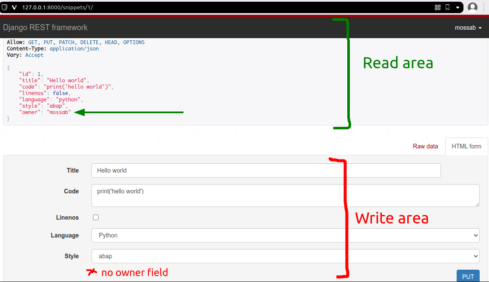

# django rest framework official tutorial 
## Part 4

### Notes:
- In models : you can auto populate fields by modifying the save function , don't forget to call `super().save(*args, **kwargs)` at the end.
- in the UserSerializer we defined snippets field like this:
``` py
class UserSerializer(serializers.ModelSerializer):
    snippets = serializers.PrimaryKeyRelatedField(many=True, queryset=Snippet.objects.all())
    # ...
```
why didn't we add it directly to fields[..,...] as usual ? , according to the tutorial :
> Because 'snippets' is a **reverse relationship** on the User model, it will not be included by default when using the ModelSerializer class, so we needed to add an explicit field for it.

reverse relationship: ✅ `snippets.owner` , but user don't have a snippets field ,yes it can be accessed from `user.snippets_set` (can even aliased to user.snippets using related_name) but still it's not defined inside the user model thus we need to define it in the serializer .

- Serializer's fields will be used in views for both Read operations aka GET and Write operations aka POST, PUT,...  , but what if we want only to show it in Read ops and not Write ops ? a valid example is snippets `owner` field, we're applying it automatically (first note) but still want to show it when we list Snippets ? To do that we re-define it in the `SnippetSerializer` 
``` py
class SnippetSerializer(serializers.ModelSerializer):
    owner = serializers.ReadOnlyField(source='owner.username')
    # owner = serializers.CharField(source='owner.username', read_only=True) # (alternative)

    class Meta:
        model = Snippet
        fields = ['id', 'title', 'code', 'linenos', 'language', 'style', 'owner']
```

You can understand the **ReadOnlyField** part as show in GET and don't give access for (POST,PUT ...) and indeed :

